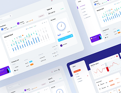
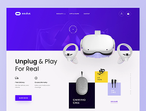
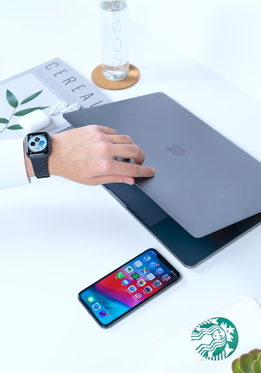

Version này dùng bootstrap thuần Để tránh việc lặp lại code html ( trên desktop dạng grid/flex sang mobile dạng corousel) VD với gallery phải tạo 2 đoạn trùng gallery-list d-block d-lg-none show trên mobile gallery-list d-none d-lg-block show trên desktop

Lưu ý với carousel Khi cần carousel item display flex , nên bọc carousel-item trong 1 carousel-item-wrap Vì TH1 Set thẳng dflex cho carousel-item => Chỉ luôn show item cuối cùng vì tính chất carousel-item dnone để tạo hiệu ứng không còn , các item nằm đè lên nhau (mr-100%) và item cuối nằm trên cùng

TH2 set dflex cho carousel-item active Gây giật layout khi transition , vì trong lúc slide: item đang block tới lúc active thì nó mới nhảy sang flex Bootstrap đang animate transform, mà display/layout thay đổi giữa chừng → vỡ cấu trúc / giật chiều cao / nhảy vị trí Dù mặc định carousel-item là dnone Bootstrap Carousel không chỉ đơn giản là show/hide. Nó có trạng thái trung gian khi slide. Bootstrap Carousel slide như thế nào?

Khi bạn bấm next, Bootstrap sẽ làm chuỗi class như này:

Ví dụ đang ở slide 1, chuyển sang slide 2:

Ban đầu

slide 1: .carousel-item active

slide 2: .carousel-item

Khi bắt đầu animation

Bootstrap thêm class:

slide 1: active carousel-item-start

slide 2: carousel-item-next carousel-item-start

Trong thời gian đó, slide 2 không còn display:none nữa, vì nó phải xuất hiện để chạy animation.

Nó được set thành dạng display: block (hoặc được override bởi CSS bootstrap cho các class next/prev).

⚠️ Và đây là chỗ giật xảy ra

Nếu bạn viết CSS kiểu:

.carousel-item.active { display: flex; }

thì trong animation:

slide mới (slide 2) lúc đầu là .carousel-item-next → display:block

tới đúng khoảnh khắc nó thành .active → CSS nhảy sang display:flex

👉 tức là trong quá trình slide, nó bị đổi từ:

block → flex

ngay trong lúc đang transform translateX.

🎯 Vì sao block → flex làm giật?

Vì block và flex layout tính kích thước khác nhau:

width/height của con

khoảng cách justify-content-between

cách co giãn của image/text

line wrapping

Khi nó chuyển sang flex, browser phải:

✅ reflow lại layout ✅ recalc height ✅ recalc width ✅ repaint

Trong lúc transition đang chạy → nhìn sẽ bị:

“nhảy chiều cao”

text dịch vị trí

hình co giãn đột ngột

Đó là cái bạn thấy là vỡ layout khi slide.

🧠 Tóm gọn:

Carousel item không phải kiểu:

hidden → active

Mà là:

hidden → next (hiện ra block để chạy animation) → active

Nếu active mới là flex thì nó đổi layout ngay lúc cuối animation. Vì vậy wrap là giải pháp chuẩn

Nếu flex nằm trong div con:

<article class="carousel-item">
  <div class="d-flex ...">...</div>
</article>

Thì flex luôn luôn tồn tại ổn định, không đổi kiểu display giữa chừng.

Bootstrap chỉ animate cái outer .carousel-item.

➡️ Mượt, không giật, không nhảy layout.

💡 Kết luận

Giật không phải vì display:none, mà vì Bootstrap có trạng thái trung gian để slide, và trong trạng thái đó item đang visible mà layout bị đổi block ↔ flex.

Nên wrap inner là best practice

```html
<!-- show từ lg trở lên -->
<div class="project-list d-none d-lg-block">
  <div class="row row-cols-lg-2 row-cols-sm-1 project-row">
    <div class="col">
      <article class="project-item d-flex align-items-center justify-content-between">
        <div class="project-item__content">
          <a href="">
            <h3 class="heading heading3 project-item__heading">Wally Website</h3>
            <p class="desc article-desc project-item__desc">Lorem ipsum dolor amet, consectetur adipiscing st elit.</p>
          </a>
          <a href="" class="project-item__case-study underline-decor">Case Study</a>
        </div>
        
      </article>
    </div>
    <div class="col">
      <article class="project-item d-flex align-items-center justify-content-between">
        <div class="project-item__content">
          <a href="">
            <h3 class="heading heading3 project-item__heading">Banking App</h3>
            <p class="desc article-desc project-item__desc">Lorem ipsum dolor amet, consectetur adipiscing st elit.</p>
          </a>
          <a href="" class="project-item__case-study underline-decor">Case Study</a>
        </div>
        
      </article>
    </div>
    <div class="col">
      <article class="project-item d-flex align-items-center justify-content-between">
        <div class="project-item__content">
          <a href="">
            <h3 class="heading heading3 project-item__heading">Web App</h3>
            <p class="desc article-desc project-item__desc">Lorem ipsum dolor amet, consectetur adipiscing st elit.</p>
          </a>
          <a href="" class="project-item__case-study underline-decor">Case Study</a>
        </div>
        
      </article>
    </div>
    <div class="col">
      <article class="project-item d-flex align-items-center justify-content-between">
        <div class="project-item__content">
          <a href="">
            <h3 class="heading heading3 project-item__heading">Oculus Website</h3>
            <p class="desc article-desc project-item__desc">Lorem ipsum dolor amet, consectetur adipiscing st elit.</p>
          </a>
          <a href="" class="project-item__case-study underline-decor">Case Study</a>
        </div>
        
      </article>
    </div>
  </div>
</div>
<!-- từ lg trở xuống show dạng carousel -->
<div id="ProjectCarousel" class="project-list carousel slide d-block d-lg-none" data-bs-ride="carousel">
  <div class="carousel-indicators ProjectCarousel-indicators">
    <button
      type="button"
      data-bs-target="#ProjectCarousel"
      data-bs-slide-to="0"
      class="ProjectCarousel-indicator carousel-indicator"
    ></button>
    <button
      type="button"
      data-bs-target="#ProjectCarousel"
      data-bs-slide-to="1"
      class="ProjectCarousel-indicator carousel-indicator"
    ></button>
    <button
      type="button"
      data-bs-target="#ProjectCarousel"
      data-bs-slide-to="2"
      class="active ProjectCarousel-indicator carousel-indicator"
    ></button>
    <button
      type="button"
      data-bs-target="#ProjectCarousel"
      data-bs-slide-to="3"
      class="ProjectCarousel-indicator carousel-indicator"
    ></button>
    <button
      type="button"
      data-bs-target="#ProjectCarousel"
      data-bs-slide-to="4"
      class="ProjectCarousel-indicator carousel-indicator"
    ></button>
  </div>
  <div class="carousel-inner">
    <article class="project-item carousel-item active">
      <div class="project-item__wrapper">
        <div class="project-item__content">
          <a href="">
            <h3 class="heading heading3 project-item__heading">Wally Website</h3>
            <p class="desc article-desc project-item__desc">Lorem ipsum dolor amet, consectetur adipiscing st elit.</p>
          </a>
          <a href="" class="project-item__case-study underline-decor">Case Study</a>
        </div>
        
      </div>
    </article>
    <article class="project-item carousel-item">
      <div class="project-item__wrapper">
        <div class="project-item__content">
          <a href="">
            <h3 class="heading heading3 project-item__heading">Banking App</h3>
            <p class="desc article-desc project-item__desc">Lorem ipsum dolor amet, consectetur adipiscing st elit.</p>
          </a>
          <a href="" class="project-item__case-study underline-decor">Case Study</a>
        </div>
        
      </div>
    </article>
    <article class="project-item carousel-item">
      <div class="project-item__wrapper">
        <div class="project-item__content">
          <a href="">
            <h3 class="heading heading3 project-item__heading">Web App</h3>
            <p class="desc article-desc project-item__desc">Lorem ipsum dolor amet, consectetur adipiscing st elit.</p>
          </a>
          <a href="" class="project-item__case-study underline-decor">Case Study</a>
        </div>
        
      </div>
    </article>
    <article class="project-item carousel-item">
      <div class="project-item__wrapper">
        <div class="project-item__content">
          <a href="">
            <h3 class="heading heading3 project-item__heading">Oculus Website</h3>
            <p class="desc article-desc project-item__desc">Lorem ipsum dolor amet, consectetur adipiscing st elit.</p>
          </a>
          <a href="" class="project-item__case-study underline-decor">Case Study</a>
        </div>
        
      </div>
    </article>
  </div>
  <button class="carousel-control-prev" type="button" data-bs-target="#ProjectCarousel" data-bs-slide="prev">
    <span class="carousel-control-prev-icon"></span>
  </button>
  <button class="carousel-control-next" type="button" data-bs-target="#ProjectCarousel" data-bs-slide="next">
    <span class="carousel-control-next-icon"></span>
  </button>
</div>
```

Vấn đề lặp lại => DOM lớn hơn , nhiều node hơn => tốn bộ nhớ và render cost Về nguyên tắc, thêm vài dòng CSS luôn nhẹ hơn việc nhân đôi số lượng phần tử HTML. DOM càng nhỏ thì render càng nhanh. Dùng bootstrap + code js tự động thêm corousel dựa trên innerwidth

Version 2 dùng swiper.js gọn hơn

Khi responsive ở mobile , phần gallery chuyển từ row-cols-xl-3 sang row-cols-xs-1 ở mobile gallery list show ở dạng carousel c1 dùng bootstrap carousel

c2 dùng swiper.js

```html
<div class="swiper gallery__list d-block d-md-none">
  <div class="swiper-wrapper">
    <div class="swiper-slide"></div>
    <div class="swiper-slide"></div>
    <div class="swiper-slide"></div>
  </div>
  <div class="swiper-pagination"></div>
</div>
```

```js
const swiper = new Swiper(".swiper", {
  pagination: { el: ".swiper-pagination" },
});
```

C3 Giữ nguyên 1 HTML list và dùng CSS + JS để biến nó thành dạng carousel ngang khi màn hình nhỏ mà không cần duplicate. Ý tưởng là:

Trên màn hình lớn: dùng Bootstrap grid (row/col) như bình thường.

Trên màn hình nhỏ: đổi layout sang flex ngang + overflow-x: auto để trượt bằng tay, hoặc thêm JS để hỗ trợ cuộn mượt. CSS Responsive

```html
<div class="gallery__list">
  <div class="row row-cols-xl-3 row-cols-xs-1">
    <div class="col">
      <article class="gallery-item">
        <a href="">
          
        </a>
      </article>
    </div>
    <div class="col">
      <article class="gallery-item">
        <a href="">
          
        </a>
      </article>
    </div>
    <div class="col">
      <article class="gallery-item">
        <a href="">
          
        </a>
      </article>
    </div>
  </div>
</div>

<!-- Nút điều hướng -->
<div class="gallery-nav d-flex justify-content-between mt-3">
  <button id="prevBtn" class="btn btn-primary">‹ Prev</button>
  <button id="nextBtn" class="btn btn-primary">Next ›</button>
</div>
```

🔹 CSS (mobile carousel)

```css
/* Mặc định: grid bootstrap */
.gallery__list .row {
  display: flex;
  flex-wrap: wrap;
}

/* Khi màn hình nhỏ (xs) thì chuyển sang trượt ngang */
@media (max-width: 576px) {
  .gallery__list .row {
    flex-wrap: nowrap; /* không xuống dòng */
    overflow-x: auto; /* cho phép cuộn ngang */
    scroll-snap-type: x mandatory; /* snap khi cuộn */
  }

  .gallery__list .col {
    flex: 0 0 auto; /* giữ kích thước item */
    width: 80%; /* mỗi item chiếm ~80% màn hình */
    scroll-snap-align: center; /* snap vào giữa */
    margin-right: 16px; /* khoảng cách giữa các item */
  }

  .gallery-item__thumb {
    width: 100%;
    height: auto;
    display: block;
  }

  /* Ẩn scrollbar nếu muốn */
  .gallery__list .row::-webkit-scrollbar {
    display: none;
  }
  .gallery__list .row {
    -ms-overflow-style: none; /* IE/Edge */
    scrollbar-width: none; /* Firefox */
  }
}
```

JS (thêm hiệu ứng cuộn mượt) Nếu muốn hỗ trợ nút điều hướng (next/prev) hoặc cuộn mượt:

```JS
document.addEventListener("DOMContentLoaded", () => {
  const row = document.querySelector(".gallery__list .row");
  const nextBtn = document.getElementById("nextBtn");
  const prevBtn = document.getElementById("prevBtn");

  nextBtn.addEventListener("click", () => {
    row.scrollBy({ left: row.clientWidth * 0.8, behavior: "smooth" });
  });

  prevBtn.addEventListener("click", () => {
    row.scrollBy({ left: -row.clientWidth * 0.8, behavior: "smooth" });
  });
});


```

Kết quả Trên desktop: vẫn là grid 3 cột.

Trên mobile: tự động chuyển thành carousel ngang cuộn bằng tay hoặc bằng nút.

Không cần duplicate HTML, chỉ dùng CSS media query + JS hỗ trợ.
